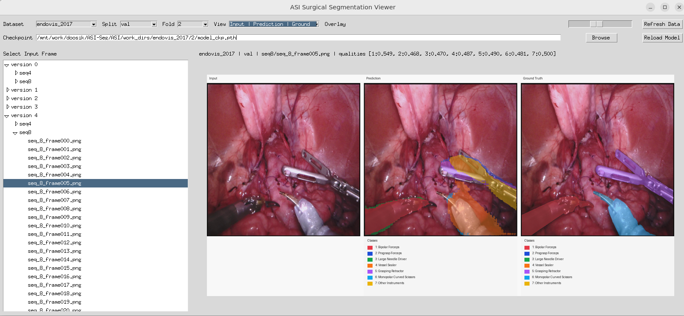

# ASI-Seg: Audio-Driven Surgical Instrument Segmentation

with Surgeon Intention Understanding

## Overview

ASI-Seg is a surgical instrument segmentation framework that combines:

- audio-driven surgeon intention understanding,
- SAM-based visual prompting,
- CLIP-based semantic representations.


## Repository Layout

- `ASI/`: core training, inference, and GUI code
- `ASI/CLIP/`: OpenAI CLIP, now tracked as a git submodule
- `segment_anything/`: SAM-related source
- `scripts/`: helper scripts for environment setup,
  data preparation, training, and GUI launch
- `data/`: datasets, SAM checkpoint, and generated training data

## Clone

CLIP is included as a submodule, so the recommended clone command is:

```bash
git clone --recurse-submodules git@github.com:doosik71/ASI-Seg.git
cd ASI-Seg
```

If you already cloned the repository without submodules, initialize them with:

```bash
git submodule update --init --recursive
```

## Requirements

- Linux
- `git`
- `python >= 3.13`
- `uv`
- `curl` or `wget`
- `unzip`
- NVIDIA GPU with a CUDA-ready PyTorch environment
  recommended for training and inference

`uv` is installed automatically by `scripts/01-init-env.sh`
if it is missing.

## Quick Start

The repository now includes shell scripts that make the full experiment flow reproducible.

### 1. Create the environment

```bash
./scripts/01-init-env.sh
source ASI/.venv/bin/activate
```

This creates `ASI/.venv` and installs dependencies with `uv sync`.

### 2. Download EndoVis datasets

```bash
./scripts/02-download-endovis.sh
```

This downloads and extracts:

- EndoVis 2017
- EndoVis 2018

The datasets are placed under `data/`.

### 3. Download the SAM checkpoint

```bash
./scripts/03-download-sam.sh
```

This downloads `sam_vit_h_4b8939.pth` into `data/sam_model/`
and verifies its SHA-256 checksum when `sha256sum` is available.

### 4. Ensure CLIP is available

If you cloned with `--recurse-submodules`, `ASI/CLIP` is already ready.

If the submodule directory is missing in your local checkout, run:

```bash
./scripts/04-setup-clip.sh
```

### 5. Prepare training data

```bash
./scripts/05-prepare-data.sh
```

This generates preprocessed data under `data/train_data/`,
including images, binary masks, SAM features,
and class embeddings.

For details about the generated dataset structure, see [DATASET.md](./DATASET.md).

### 6. Train

```bash
./scripts/06-train-model.sh --dataset endovis_2017
```

You can also train on EndoVis 2018:

```bash
./scripts/06-train-model.sh --dataset endovis_2018
```

The script automatically links the SAM checkpoint
to the path expected by the training code.

## Evaluation / Inference

Run inference from the project root:

```bash
source ASI/.venv/bin/activate
cd ASI
python inference.py --dataset endovis_2017 --fold 3
```

For EndoVis 2018:

```bash
source ASI/.venv/bin/activate
cd ASI
python inference.py --dataset endovis_2018
```

Inference expects:

- prepared data in `data/train_data/`
- SAM checkpoint at `ckp/sam/sam_vit_h_4b8939.pth`
- trained model checkpoints in `ASI/work_dirs/`

If you only ran `scripts/03-download-sam.sh`,
create the compatibility link once before direct inference:

```bash
mkdir -p ckp/sam
ln -sf "$(pwd)/data/sam_model/sam_vit_h_4b8939.pth" ckp/sam/sam_vit_h_4b8939.pth
```

## Result Viewer GUI

A Tkinter-based GUI is provided for browsing frames
and visualizing segmentation results:

```bash
./scripts/07-show-results.sh
```

The GUI supports:

- dataset selection,
- fold selection for EndoVis 2017,
- frame browsing,
- prediction and overlay visualization



## Manual Commands

If you prefer running code directly instead of helper scripts:

```bash
source ASI/.venv/bin/activate
mkdir -p ckp/sam
ln -sf "$(pwd)/data/sam_model/sam_vit_h_4b8939.pth" ckp/sam/sam_vit_h_4b8939.pth
cd ASI
python train.py --dataset endovis_2017
python inference.py --dataset endovis_2017 --fold 3
python vizualize.py
```

## Datasets

The experiments use:

- [EndoVis 2018](https://cataracts2018.grand-challenge.org/data/)
- [EndoVis 2017](
  https://endovissub2017-kidneyboundarydetection.grand-challenge.org/Data/
  )

Preprocessing references:

- EndoVis 2017 follows
  [robot-surgery-segmentation](https://github.com/ternaus/robot-surgery-segmentation)
- EndoVis 2018 uses annotations from
  [ISINet](https://github.com/BCV-Uniandes/ISINet)

## Checkpoints

ASI-Seg uses:

- SAM `vit_h`
- CLIP `ViT-L/14`

The SAM checkpoint used by this repository is:

- <https://dl.fbaipublicfiles.com/segment_anything/sam_vit_h_4b8939.pth>

## Citation

If you use our code or paper in your work,
please cite:

```bibtex
@inproceedings{chen2024iros,
 title={{ASI-Seg: Audio-Driven Surgical Instrument Segmentation
 with Surgeon Intention Understanding}},
 author={Zhen Chen, Zongming Zhang, Wenwu Guo, Xingjian Luo,
 Long Bai, Jinlin Wu, Hongliang Ren, Hongbin Liu},
 booktitle={IEEE/RSJ International Conference on Intelligent
 Robots and Systems (IROS)},
 year={2024}
}
```
